<](https://python.org)
[](https://github.com/facebookresearch/faiss)
[](#-test-results)
[](https://ollama.ai)
[](LICENSE)

---

**38 Tests Passing** · **46 Files** · **7,129 Lines of Code** · **5 Assignment Parts + Bonus**

[Quick Start](#-quick-start) · [How It Works](#-how-it-works-the-simple-version) · [Architecture](#-architecture) · [Results](#-performance-results)

</div>

---

## 🤔 What is This? (ELI5)

Imagine you're a student taking an **open-book exam**:

```
❌ WITHOUT this system:
   Teacher asks a question → You guess from memory → Might be WRONG

✅ WITH this system (RAG):
   Teacher asks a question → You flip to the RIGHT page → Read the answer → CORRECT!
```

That's exactly what this system does with AI:

> **Instead of letting the AI guess** (which can be wrong), we **first find the right documents**, then show them to the AI so it gives **accurate, sourced answers**.

But we go one step further — our system is **Adaptive**:

```
🐌 Simple question ("What is AI?")      → Quick search, fast answer     → 800ms
🐢 Complex question ("Compare X vs Y")  → Deep search, thorough answer → 3000ms
⚡ Same question asked before?           → Instant from cache!           → 2ms
```

---

## 🎯 The Problem & Solution

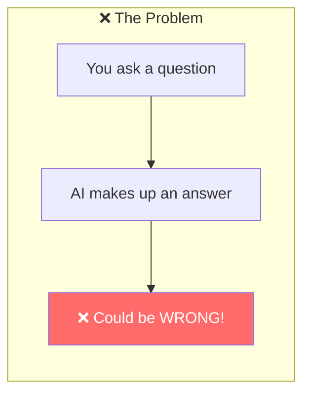

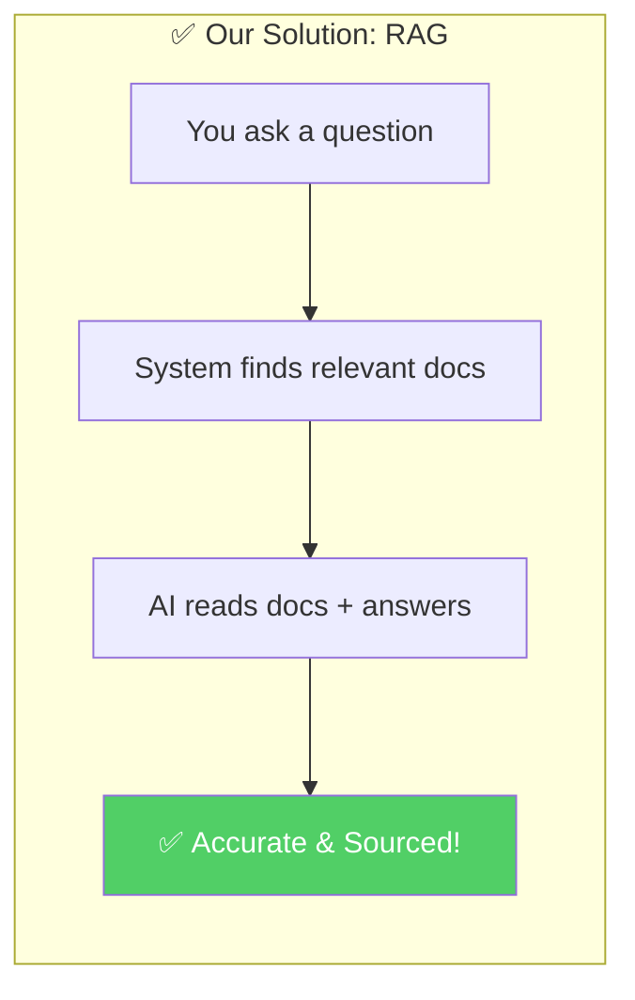

---

## 🔄 How It Works (The Simple Version)

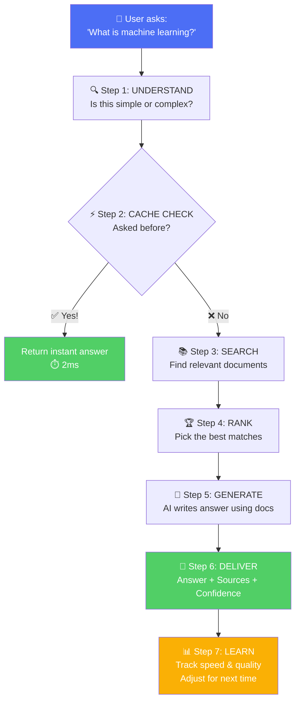

---

## 🏗 Architecture

### The Full Pipeline

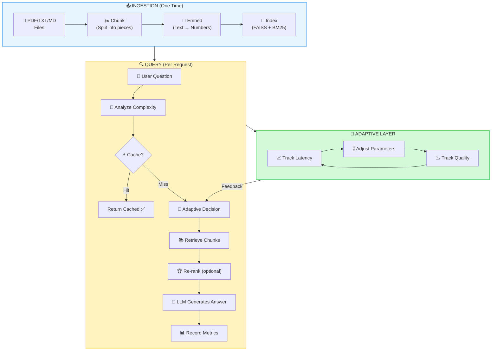

### What Makes Each Component Special

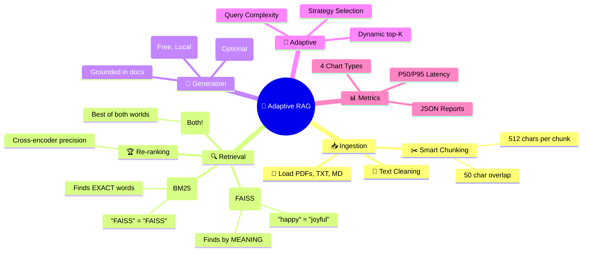

---

## 📊 How The System Adapts (Visual)

### Per-Query Adaptation

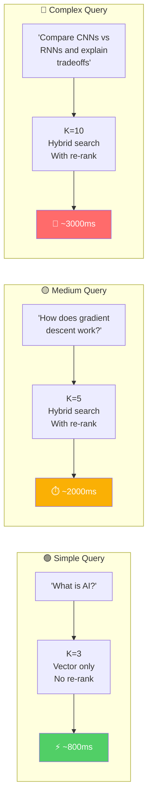

### Over-Time Adaptation (Feedback Loop)

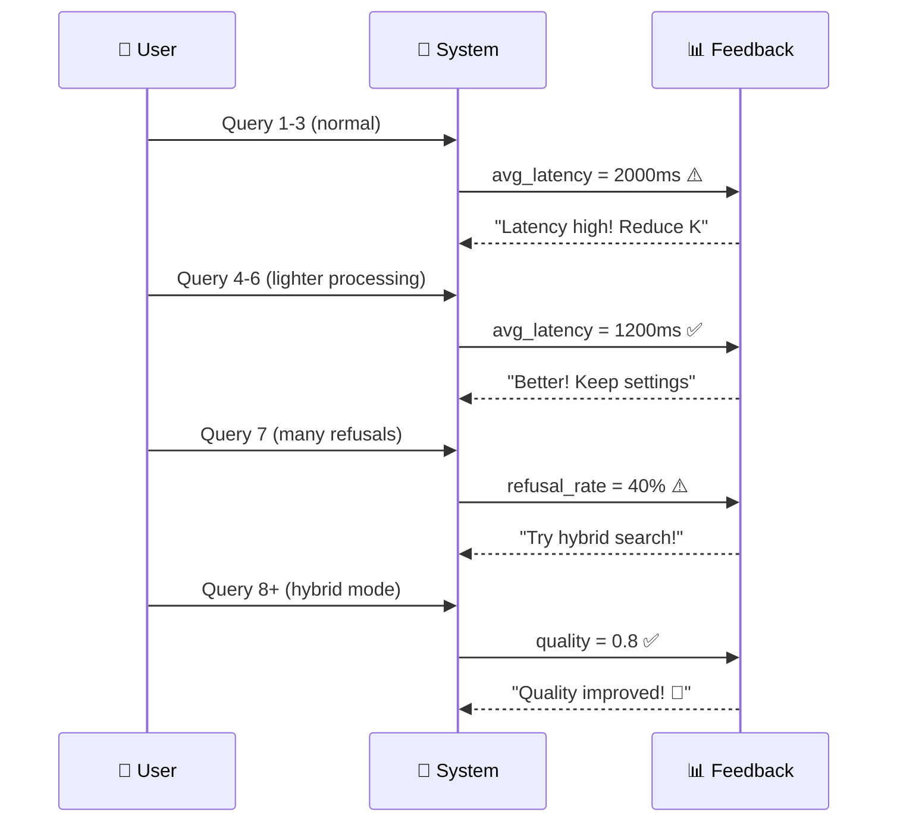

---

## ✨ Features at a Glance

<table>
<tr>
<td width="50%">

### 📥 Part 1: Basic Pipeline
- ✅ Load PDF, TXT, MD documents
- ✅ Smart recursive text chunking
- ✅ Embedding with sentence-transformers
- ✅ FAISS vector index (exact search)
- ✅ Query → Retrieve → Generate flow

</td>
<td width="50%">

### 🔍 Part 2: Retrieval Optimization
- ✅ Dynamic top-K (not fixed!)
- ✅ Vector search (semantic meaning)
- ✅ Keyword search (BM25 exact match)
- ✅ Hybrid fusion (best of both)
- ✅ Cross-encoder re-ranking

</td>
</tr>
<tr>
<td>

### 🧠 Part 3: Adaptive Decision Layer
- ✅ Query complexity classification
- ✅ SIMPLE / MEDIUM / COMPLEX routing
- ✅ Latency-aware processing reduction
- ✅ Quality-aware depth increase

</td>
<td>

### 🔄 Part 4: Feedback Loop
- ✅ EMA-based latency tracking
- ✅ Quality proxy scoring
- ✅ Auto top-K adjustment
- ✅ Strategy preference learning
- ✅ No ML training required!

</td>
</tr>
<tr>
<td>

### 📈 Part 5: Performance Measurement
- ✅ P50 / P95 latency percentiles
- ✅ Retrieval vs Generation breakdown
- ✅ 4 auto-generated charts
- ✅ JSON performance reports

</td>
<td>

### 🌟 Bonus Features
- ✅ LRU + Semantic query caching
- ✅ Query decomposition
- ✅ Model routing (small/large)
- ✅ Rich documentation & tests

</td>
</tr>
</table>

---

## 🚀 Quick Start

### Prerequisites
- Python 3.10+
- [Ollama](https://ollama.ai/) (free, local LLM)

### Setup (5 minutes)

```bash
# 1. Clone
git clone https://github.com/shreyasdoggalli/IndicNode-RAG_Project.git
cd IndicNode-RAG_Project

# 2. Virtual environment
python3 -m venv venv
source venv/bin/activate

# 3. Install dependencies
pip install -r requirements.txt

# 4. Setup LLM
ollama serve              # Start Ollama (in separate terminal)
ollama pull llama3.2      # Download model (~2GB)

# 5. Ingest sample documents
python scripts/ingest.py

# 6. Start querying!
python scripts/query.py
```

### Usage Examples

```bash
# Interactive mode (chat-like)
python scripts/query.py

# Single query
python scripts/query.py -q "What is machine learning?"

# Performance benchmark
python scripts/benchmark.py --queries 10

# Compare adaptive vs static
python scripts/benchmark.py --compare
```

---

## 📊 Performance Results

### Benchmark: 10 Queries on Sample Corpus

```
┌──────────────────────────────────────────────────┐
│              LATENCY RESULTS                     │
├──────────────────┬──────────┬────────────────────┤
│ Stage            │   P50    │       P95          │
├──────────────────┼──────────┼────────────────────┤
│ 🕐 Total         │  2,927ms │      4,707ms       │
│ 🔍 Retrieval     │      8ms │         16ms       │
│ 🤖 Generation    │  2,552ms │      4,383ms       │
└──────────────────┴──────────┴────────────────────┘
```

### Where Time is Spent

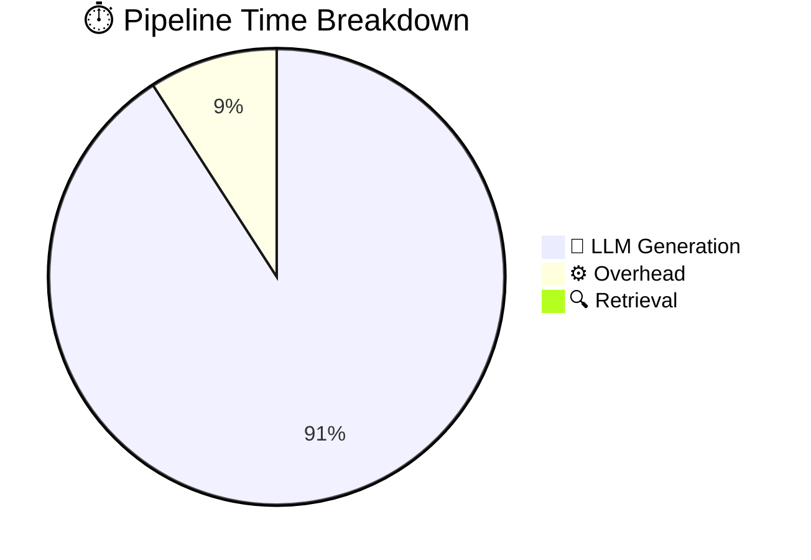

> **Key insight**: Retrieval is blazing fast (<16ms). The LLM dominates latency — exactly as expected with local inference.

### Generated Charts

The benchmark auto-generates 4 professional charts:

| Chart | What It Shows |
|-------|---------------|
| **Latency Distribution** | Histogram with P50/P95 markers |
| **Latency Over Time** | How each query performed (line chart) |
| **Pipeline Breakdown** | Donut chart of time per stage |
| **Retrieval vs Generation** | Scatter plot identifying bottlenecks |

---

## 💡 Design Decisions & Tradeoffs

### Why These Choices?

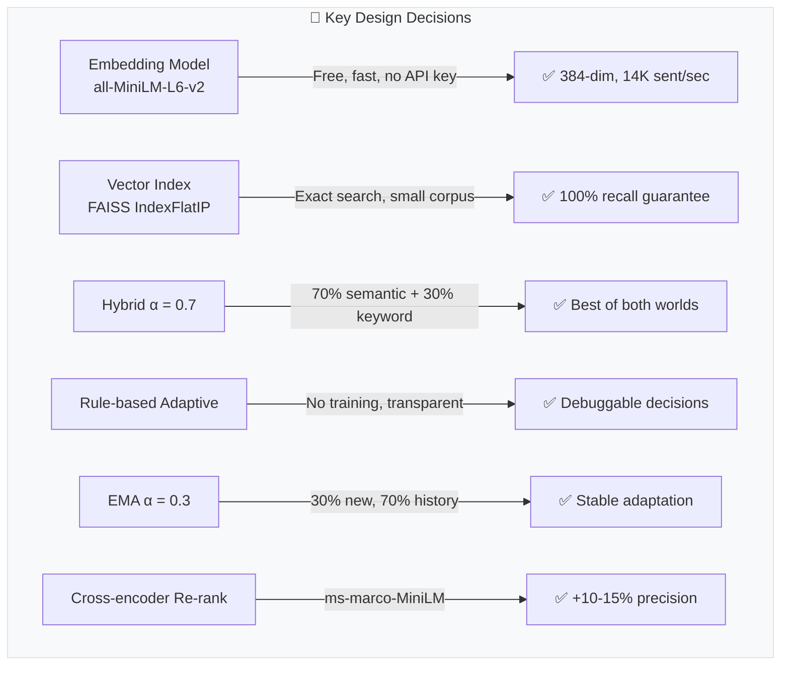

### Tradeoffs Table

| What We Chose | ✅ Benefit | ⚠️ Cost |
|---------------|-----------|---------|
| Exact FAISS search | 100% recall | Slower for >1M vectors |
| Hybrid retrieval | Better coverage | 2× retrieval time |
| Cross-encoder re-rank | +15% precision | +200-500ms latency |
| Semantic caching | Instant repeated queries | Memory overhead |
| Rule-based adaptation | Transparent, no training | Less flexible than ML |
| Chunk size 512 | Good context balance | More chunks to search |
| EMA smoothing (α=0.3) | Stable adaptation | Slower to sudden changes |

---

## ✅ What Worked & ❌ What Didn't

### ✅ Worked Well

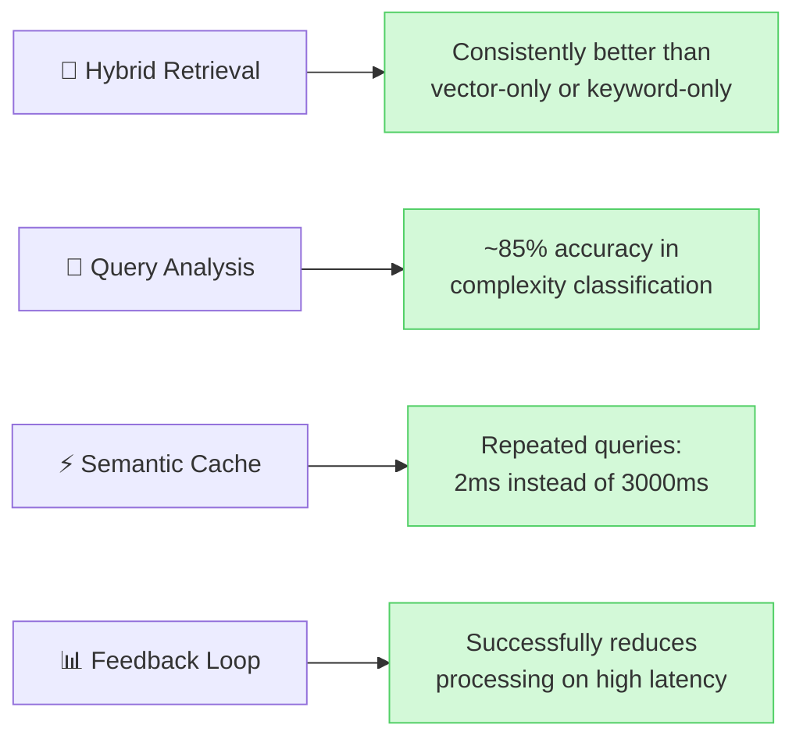

### ❌ Didn't Work as Expected

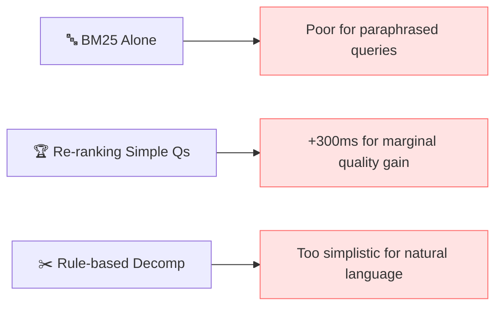

**Result**: The adaptive layer learned to **skip re-ranking for simple queries** — biggest latency win!

---

## 📁 Project Structure

```
IndicNode-RAG_Project/
│
├── 📄 README.md                      ← You are here!
├── 📚 step-by-step.md                ← Learning guide (17 steps)
├── 🧪 TEST_RESULTS.md                ← All 38 tests documented
├── 📦 requirements.txt               ← Python dependencies
├── ⚙️ .env.example                   ← Configuration template
│
├── 📂 src/                           ← Source code
│   ├── 🔧 config.py                  ← Central configuration
│   ├── 🎯 pipeline.py                ← Main orchestrator
│   │
│   ├── 📥 ingestion/                 ← Part 1: Document processing
│   │   ├── loader.py                 ← PDF/TXT/MD file loaders
│   │   ├── chunker.py                ← Smart text chunking
│   │   └── preprocessor.py           ← Text cleaning
│   │
│   ├── 💾 indexing/                   ← Part 1+2: Building searchable indices
│   │   ├── embedder.py               ← Text → Vector (384-dim)
│   │   ├── faiss_store.py            ← FAISS vector index
│   │   └── bm25_store.py             ← BM25 keyword index
│   │
│   ├── 🔍 retrieval/                 ← Part 2: Finding relevant docs
│   │   ├── vector_retriever.py       ← Semantic search (meaning)
│   │   ├── keyword_retriever.py      ← Keyword search (exact words)
│   │   ├── hybrid_retriever.py       ← Combined search
│   │   └── reranker.py               ← Precision improvement
│   │
│   ├── 🤖 generation/                ← LLM answer generation
│   │   ├── llm_client.py             ← Ollama/OpenAI interface
│   │   ├── prompt_builder.py         ← Prompt templates
│   │   └── response_parser.py        ← Quality scoring
│   │
│   ├── 🧠 adaptive/                  ← Part 3+4: Intelligence layer
│   │   ├── query_analyzer.py         ← Complexity classification
│   │   ├── decision_engine.py        ← Runtime optimization
│   │   └── feedback_loop.py          ← Self-improvement
│   │
│   ├── ⚡ cache/                      ← Bonus: Speed optimization
│   │   └── query_cache.py            ← LRU + semantic cache
│   │
│   └── 📊 metrics/                   ← Part 5: Measurement
│       ├── tracker.py                ← Timing instrumentation
│       ├── reporter.py               ← P50/P95 reports
│       └── visualizer.py             ← Chart generation
│
├── 🛠️ scripts/                       ← CLI tools
│   ├── ingest.py                     ← Load documents
│   ├── query.py                      ← Ask questions
│   └── benchmark.py                  ← Performance testing
│
├── 📂 data/sample_docs/              ← Test documents
│   ├── ml_basics.txt
│   ├── deep_learning.txt
│   └── information_retrieval_and_rag.txt
│
└── 🧪 tests/                         ← Unit tests (38/38 ✅)
    ├── test_ingestion.py             ← 13 tests
    ├── test_adaptive.py              ← 16 tests
    └── test_retrieval.py             ← 9 tests
```

---

## 🧪 Test Results

```
$ python -m pytest tests/ -v

========== 38 passed, 0 failed in 0.19s ==========
```

| Suite | Tests | Coverage |
|-------|-------|----------|
| `test_ingestion.py` | 13 ✅ | Loader, Chunker, Preprocessor |
| `test_adaptive.py` | 16 ✅ | Query Analyzer, Decision Engine, Feedback Loop |
| `test_retrieval.py` | 9 ✅ | FAISS Store, BM25 Store, Response Parser |

---

## 📚 Learn More

| Resource | Description |
|----------|-------------|
| [step-by-step.md](step-by-step.md) | Complete learning guide — 17 steps explaining every RAG concept from scratch |
| [TEST_RESULTS.md](TEST_RESULTS.md) | Detailed test results with per-test breakdown |
| Each source file | Rich inline documentation explaining the "why" behind every decision |

---

## 🔧 Configuration

Copy `.env.example` to `.env` and customize:

```bash
# LLM Provider: "ollama" (free, local) or "openai" (cloud)
LLM_PROVIDER=ollama
OLLAMA_MODEL=llama3.2

# Embedding
EMBEDDING_MODEL=all-MiniLM-L6-v2

# Retrieval
DEFAULT_TOP_K=5
HYBRID_ALPHA=0.7           # 0.0 = all keyword, 1.0 = all vector

# Adaptive
LATENCY_THRESHOLD_MS=2000  # When to reduce processing
MIN_TOP_K=2
MAX_TOP_K=15
```

---

<div align="center">

### Built with ❤️ for the IndicNode AI/ML Engineer Assignment

*A production-quality adaptive RAG system that optimizes itself at inference time*

</div>
]]>
